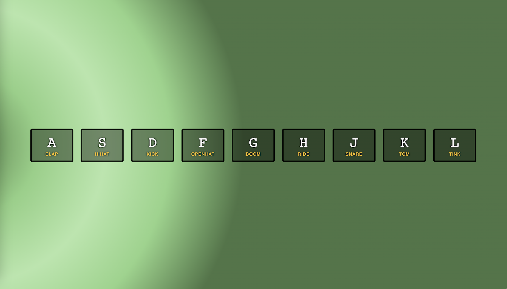

# DRUM KIT PROJECT

> A simple project for the beginners.

## ✅ Table of contents

- [Drum-kit Project](https://haneefa-shaik.github.io/Drum-kit-project)
  - [✅ Table of contents](#-table-of-contents)
  - [✅ General info](#-general-info)
  - [✅ Screenshots](#-screenshots)
  - [✅ Technologies](#-technologies)
  - [✅ Code Examples](#-code-examples)
  - [✅ Status](#-status)
 

## ✅ General info

This project's main goal is to build a simple drum kit using HTML, CSS, and Javascript that runs in a browser which will play the sound when the user press on particular key on the keyboard.

## ✅ Screenshots



## ✅ Technologies

- HTML 5
- CSS 3
- VS Code
- Javascript

## ✅ Code Examples

```<!DOCTYPE html>
<html lang="en">
  <head>
    <meta charset="UTF-8" />
    <link rel="icon" type="image/svg+xml" href="./client/assets/favicon.ico" />
    <meta name="viewport" content="width=device-width, initial-scale=1.0" />
    <title>project!</title>

    <link href="./styles/index.css" rel="stylesheet" />
  </head>
  <body></body>
</html>

```

## ✅ Status

Project is: _Completed_

